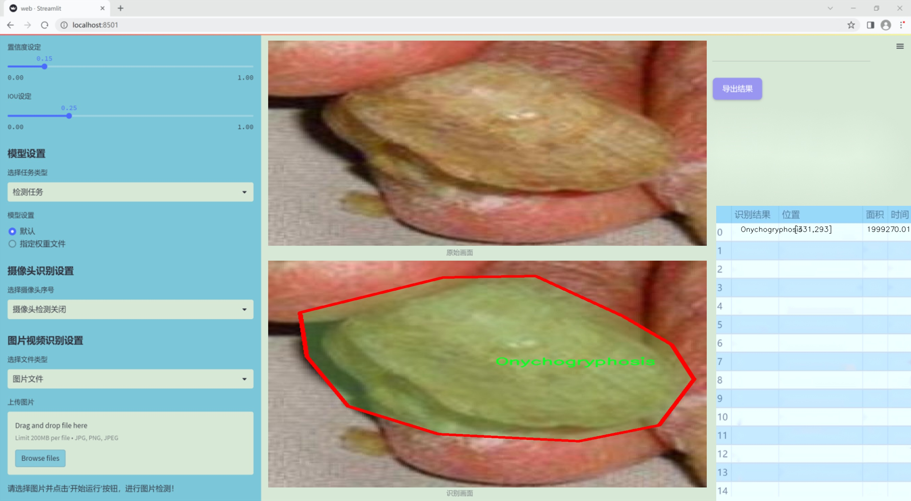
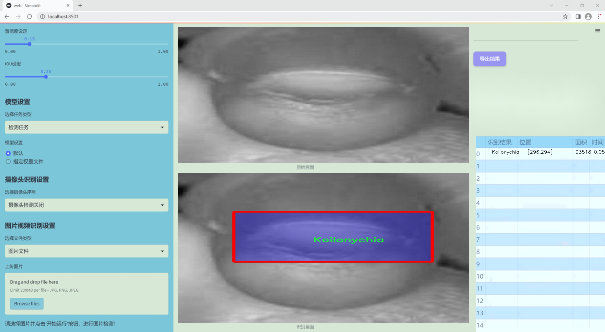
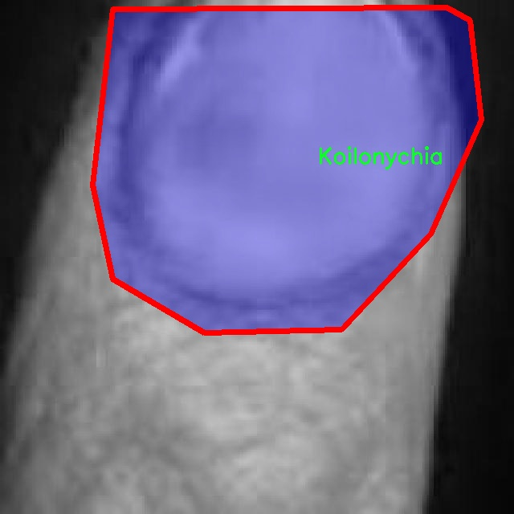
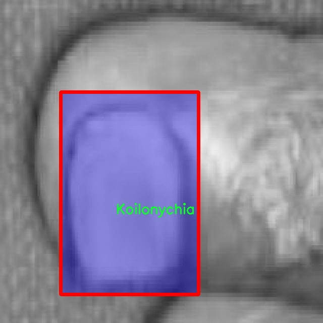
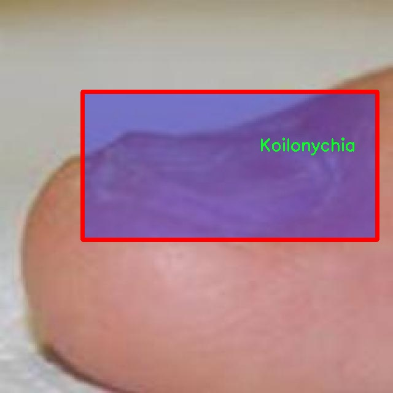
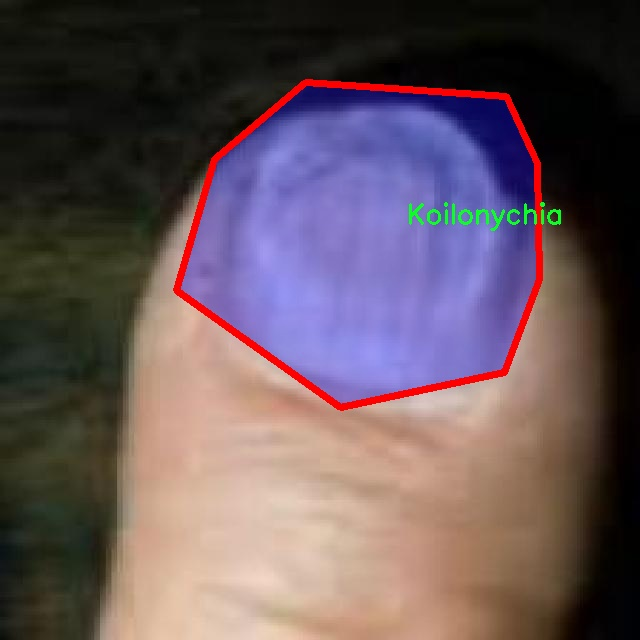
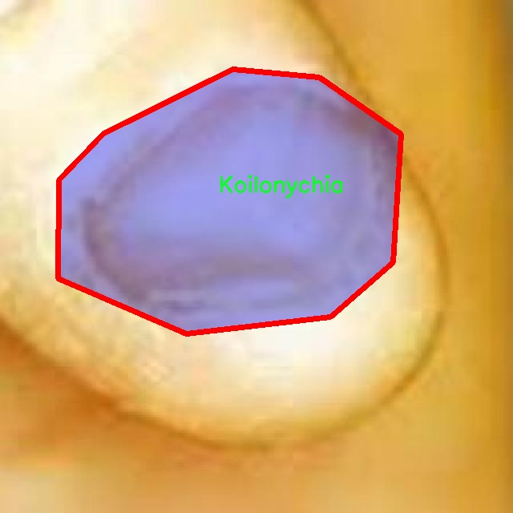

### 1.背景意义

### 研究背景与意义

指甲疾病的早期检测对于改善患者的预后和生活质量至关重要。指甲不仅是身体健康的外在表现，还能反映出潜在的系统性疾病。随着生活方式的变化和环境因素的影响，指甲疾病的发生率逐渐上升，尤其是一些恶性肿瘤如指甲下黑色素瘤（Acral Lentiginous Melanoma）等。因此，开发一个高效、准确的指甲疾病检测系统显得尤为重要。

近年来，计算机视觉技术的迅猛发展为医学影像分析提供了新的机遇。YOLO（You Only Look Once）系列模型因其实时性和高精度而广泛应用于物体检测领域。YOLOv11作为该系列的最新版本，结合了深度学习和图像处理技术，能够在复杂背景下快速识别和分类目标物体。通过对YOLOv11的改进，我们可以针对指甲疾病的特征进行优化，从而提高检测的准确性和效率。

本研究基于一个包含2600张图像的NailCheck数据集，涵盖了四种主要的指甲疾病：指甲下黑色素瘤、指甲凹陷症、指甲粗糙症和特瑞氏指甲。这些图像经过精细标注，适合用于训练和测试深度学习模型。通过对这些数据的深入分析和处理，我们可以构建一个智能化的指甲疾病检测系统，帮助医生在临床实践中进行快速、准确的诊断。

本项目的意义不仅在于推动指甲疾病检测技术的发展，更在于提升公众对指甲健康的重视。通过该系统的应用，能够实现早期筛查和干预，降低疾病的发生率，提高患者的生活质量。此外，该系统的成功实施还将为其他领域的医学影像分析提供借鉴，推动人工智能在医疗健康领域的广泛应用。

### 2.视频效果

[2.1 视频效果](https://www.bilibili.com/video/BV1M1kFYhEDu/)

### 3.图片效果






##### [项目涉及的源码数据来源链接](https://kdocs.cn/l/cszuIiCKVNis)**

注意：本项目提供训练的数据集和训练教程,由于版本持续更新,暂不提供权重文件（best.pt）,请按照6.训练教程进行训练后实现上图演示的效果。

### 4.数据集信息

##### 4.1 本项目数据集类别数＆类别名

nc: 4
names: ['Acral Lentiginous Melanoma', 'Koilonychia', 'Onychogryphosis', 'Terry-s nail']


该项目为【图像分割】数据集，请在【训练教程和Web端加载模型教程（第三步）】这一步的时候按照【图像分割】部分的教程来训练

##### 4.2 本项目数据集信息介绍

本项目数据集信息介绍

本项目所使用的数据集名为“NailCheck”，旨在为改进YOLOv11的指甲疾病检测系统提供高质量的训练数据。该数据集包含四个主要类别，分别是“Acral Lentiginous Melanoma”（指甲下黑色素瘤）、“Koilonychia”（匙状甲）、“Onychogryphosis”（甲肥厚症）和“Terry's nail”（特里指甲）。这些类别涵盖了指甲疾病的多样性，能够有效地支持模型在实际应用中的准确性和鲁棒性。

数据集的构建过程注重多样性和代表性，确保涵盖不同人群、年龄段和性别的样本。这些样本不仅包括不同类型的指甲疾病，还涉及各种指甲的形态特征和颜色变化，使得模型能够学习到丰富的特征信息。每个类别的数据均经过专业医生的标注，确保了数据的准确性和可靠性。此外，数据集中还包含了不同光照条件和拍摄角度下的图像，以增强模型对现实世界中复杂场景的适应能力。

在数据预处理阶段，我们对图像进行了标准化处理，以提高模型训练的效率和效果。通过数据增强技术，如旋转、缩放和翻转等，我们进一步扩展了数据集的规模，增加了模型的泛化能力。这些措施将有助于提高YOLOv11在指甲疾病检测任务中的性能，使其能够在临床环境中更好地辅助医生进行诊断。

总之，“NailCheck”数据集为本项目提供了一个坚实的基础，旨在通过深度学习技术，提升指甲疾病的自动检测能力，最终实现更高效的医疗服务。











### 5.全套项目环境部署视频教程（零基础手把手教学）

[5.1 所需软件PyCharm和Anaconda安装教程（第一步）](https://www.bilibili.com/video/BV1BoC1YCEKi/?spm_id_from=333.999.0.0&vd_source=bc9aec86d164b67a7004b996143742dc)


[5.2 安装Python虚拟环境创建和依赖库安装视频教程（第二步）](https://www.bilibili.com/video/BV1ZoC1YCEBw?spm_id_from=333.788.videopod.sections&vd_source=bc9aec86d164b67a7004b996143742dc)

### 6.改进YOLOv11训练教程和Web_UI前端加载模型教程（零基础手把手教学）

[6.1 改进YOLOv11训练教程和Web_UI前端加载模型教程（第三步）](https://www.bilibili.com/video/BV1BoC1YCEhR?spm_id_from=333.788.videopod.sections&vd_source=bc9aec86d164b67a7004b996143742dc)


按照上面的训练视频教程链接加载项目提供的数据集，运行train.py即可开始训练



     Epoch   gpu_mem       box       obj       cls    labels  img_size
     1/200     20.8G   0.01576   0.01955  0.007536        22      1280: 100%|██████████| 849/849 [14:42<00:00,  1.04s/it]
               Class     Images     Labels          P          R     mAP@.5 mAP@.5:.95: 100%|██████████| 213/213 [01:14<00:00,  2.87it/s]
                 all       3395      17314      0.994      0.957      0.0957      0.0843

     Epoch   gpu_mem       box       obj       cls    labels  img_size
     2/200     20.8G   0.01578   0.01923  0.007006        22      1280: 100%|██████████| 849/849 [14:44<00:00,  1.04s/it]
               Class     Images     Labels          P          R     mAP@.5 mAP@.5:.95: 100%|██████████| 213/213 [01:12<00:00,  2.95it/s]
                 all       3395      17314      0.996      0.956      0.0957      0.0845

     Epoch   gpu_mem       box       obj       cls    labels  img_size
     3/200     20.8G   0.01561    0.0191  0.006895        27      1280: 100%|██████████| 849/849 [10:56<00:00,  1.29it/s]
               Class     Images     Labels          P          R     mAP@.5 mAP@.5:.95: 100%|███████   | 187/213 [00:52<00:00,  4.04it/s]
                 all       3395      17314      0.996      0.957      0.0957      0.0845


###### [项目数据集下载链接](https://kdocs.cn/l/cszuIiCKVNis)

### 7.原始YOLOv11算法讲解

YOLOv11是一种由Ultralytics公司开发的最新一代目标检测模型，以其增强的特征提取能力和更高的效率在计算机视觉领域引人注目。该模型在架构上进行了关键升级，通过更新主干和颈部结构，显著提高了对复杂视觉场景的理解和处理精度。YOLOv11不仅在目标检测上表现出色，还支持实例分割、图像分类、姿态估计和定向目标检测（OBB）等任务，展示出其多功能性。

与其前身YOLOv8相比，YOLOv11在设计上实现了深度和宽度的改变，同时引入了几个创新机制。其中，C3k2机制是对YOLOv8中的C2f的改进，提升了浅层特征的处理能力；C2PSA机制则进一步优化了特征图的处理流程。解耦头的创新设计，通过增加两个深度卷积（DWConv），提高了模型对细节的感知能力和分类准确性。

在性能上，YOLOv11m模型在COCO数据集上的平均精度（mAP）提高，并减少了22%的参数量，确保了在运算效率上的突破。该模型可以部署在多种平台上，包括边缘设备、云平台以及支持NVIDIA GPU的系统，彰显出卓越的灵活性和适应性。总体而言，YOLOv11通过一系列的创新突破，对目标检测领域产生了深远的影响，并为未来的开发提供了新的研究方向。


****文档**** ： _ _https://docs.ultralytics.com/models/yolo11/__

****代码链接**** ： _ _https://github.com/ultralytics/ultralytics__

******Performance Metrics******


​ ** **关键特性****

****◆**** ** **增强的特征提取能力**** ：YOLO11采用了改进的主干和颈部架构，增强了 ** **特征提取****
能力，能够实现更精确的目标检测和复杂任务的执行。

****◆**** ** **优化的效率和速度****
：YOLO11引入了精细化的架构设计和优化的训练流程，提供更快的处理速度，并在准确性和性能之间保持最佳平衡。

****◆**** ** **参数更少、精度更高****
：通过模型设计的改进，YOLO11m在COCO数据集上实现了更高的平均精度（mAP），同时使用的参数比YOLOv8m少22%，使其在计算上更加高效，而不牺牲准确性。

****◆**** ** **跨环境的适应性**** ：YOLO11可以无缝部署在各种环境中，包括边缘设备、云平台和支持NVIDIA
GPU的系统，确保最大的灵活性。

****◆**** ** **支持广泛任务****
：无论是目标检测、实例分割、图像分类、姿态估计还是定向目标检测（OBB），YOLO11都旨在应对一系列计算机视觉挑战。

****支持的任务和模式****


​YOLO11建立在YOLOv8中引入的多功能模型范围之上，为各种计算机视觉任务提供增强的支持:


​该表提供了YOLO11模型变体的概述，展示了它们在特定任务中的适用性以及与Inference、Validation、Training和Export等操作模式的兼容性。从实时检测到复杂的分割任务
，这种灵活性使YOLO11适用于计算机视觉的广泛应用。

##### yolov11的创新

■ yolov8 VS yolov11

YOLOv5，YOLOv8和YOLOv11均是ultralytics公司的作品，ultralytics出品必属精品。


​ **具体创新点** ：

**① 深度（depth）和宽度 （width）**

YOLOv8和YOLOv11是基本上完全不同。

**② C3k2机制**

C3k2有参数为c3k，其中在网络的浅层c3k设置为False。C3k2就相当于YOLOv8中的C2f。


​ **③ C2PSA机制**

下图为C2PSA机制的原理图。


​ **④ 解耦头**

解耦头中的分类检测头增加了两个 **DWConv** 。


▲Conv

    
    
    def autopad(k, p=None, d=1):  # kernel, padding, dilation
    
        """Pad to 'same' shape outputs."""
    
        if d > 1:
    
            k = d * (k - 1) + 1 if isinstance(k, int) else [d * (x - 1) + 1 for x in k]  # actual kernel-size
    
        if p is None:
    
            p = k // 2 if isinstance(k, int) else [x // 2 for x in k]  # auto-pad
    
    return p
    
    
    class Conv(nn.Module):
    
        """Standard convolution with args(ch_in, ch_out, kernel, stride, padding, groups, dilation, activation)."""
    
    
        default_act = nn.SiLU()  # default activation
    
    
        def __init__(self, c1, c2, k=1, s=1, p=None, g=1, d=1, act=True):
    
            """Initialize Conv layer with given arguments including activation."""
    
            super().__init__()
    
            self.conv = nn.Conv2d(c1, c2, k, s, autopad(k, p, d), groups=g, dilation=d, bias=False)
    
            self.bn = nn.BatchNorm2d(c2)
    
            self.act = self.default_act if act is True else act if isinstance(act, nn.Module) else nn.Identity()
    
    
        def forward(self, x):
    
            """Apply convolution, batch normalization and activation to input tensor."""
    
            return self.act(self.bn(self.conv(x)))
    
    
        def forward_fuse(self, x):
    
            """Perform transposed convolution of 2D data."""
    
            return self.act(self.conv(x))

▲Conv2d

    
    
    torch.nn.Conv2d(in_channels, out_channels, kernel_size, stride=1, padding=0, dilation=1, groups=1, bias=True, padding_mode='zeros')

▲DWConv

DWConv ** **代表 Depthwise Convolution（深度卷积）****
，是一种在卷积神经网络中常用的高效卷积操作。它主要用于减少计算复杂度和参数量。

    
    
    class DWConv(Conv):
    
        """Depth-wise convolution."""
    
    
        def __init__(self, c1, c2, k=1, s=1, d=1, act=True):  # ch_in, ch_out, kernel, stride, dilation, activation
    
            """Initialize Depth-wise convolution with given parameters."""
    
            super().__init__(c1, c2, k, s, g=math.gcd(c1, c2), d=d, act=act)


### 8.200+种全套改进YOLOV11创新点原理讲解

#### 8.1 200+种全套改进YOLOV11创新点原理讲解大全

由于篇幅限制，每个创新点的具体原理讲解就不全部展开，具体见下列网址中的改进模块对应项目的技术原理博客网址【Blog】（创新点均为模块化搭建，原理适配YOLOv5~YOLOv11等各种版本）

[改进模块技术原理博客【Blog】网址链接](https://gitee.com/qunmasj/good)


#### 8.2 精选部分改进YOLOV11创新点原理讲解

###### 这里节选部分改进创新点展开原理讲解(完整的改进原理见上图和[改进模块技术原理博客链接](https://gitee.com/qunmasj/good)【如果此小节的图加载失败可以通过CSDN或者Github搜索该博客的标题访问原始博客，原始博客图片显示正常】

### 动态蛇形卷积Dynamic Snake Convolution

参考论文： 2307.08388.pdf (arxiv.org)

血管、道路等拓扑管状结构的精确分割在各个领域都至关重要，确保下游任务的准确性和效率。 然而，许多因素使任务变得复杂，包括薄的局部结构和可变的全局形态。在这项工作中，我们注意到管状结构的特殊性，并利用这些知识来指导我们的 DSCNet 在三个阶段同时增强感知：特征提取、特征融合、 和损失约束。 首先，我们提出了一种动态蛇卷积，通过自适应地关注细长和曲折的局部结构来准确捕获管状结构的特征。 随后，我们提出了一种多视图特征融合策略，以补充特征融合过程中多角度对特征的关注，确保保留来自不同全局形态的重要信息。 最后，提出了一种基于持久同源性的连续性约束损失函数，以更好地约束分割的拓扑连续性。 2D 和 3D 数据集上的实验表明，与多种方法相比，我们的 DSCNet 在管状结构分割任务上提供了更好的准确性和连续性。 我们的代码是公开的。 
主要的挑战源于细长微弱的局部结构特征与复杂多变的全局形态特征。本文关注到管状结构细长连续的特点，并利用这一信息在神经网络以下三个阶段同时增强感知：特征提取、特征融合和损失约束。分别设计了动态蛇形卷积（Dynamic Snake Convolution），多视角特征融合策略与连续性拓扑约束损失。 

我们希望卷积核一方面能够自由地贴合结构学习特征，另一方面能够在约束条件下不偏离目标结构太远。在观察管状结构的细长连续的特征后，脑海里想到了一个动物——蛇。我们希望卷积核能够像蛇一样动态地扭动，来贴合目标的结构。

我们希望卷积核一方面能够自由地贴合结构学习特征，另一方面能够在约束条件下不偏离目标结构太远。在观察管状结构的细长连续的特征后，脑海里想到了一个动物——蛇。我们希望卷积核能够像蛇一样动态地扭动，来贴合目标的结构。


### DCNV2融入YOLOv11
DCN和DCNv2（可变性卷积）
网上关于两篇文章的详细描述已经很多了，我这里具体的细节就不多讲了，只说一下其中实现起来比较困惑的点。（黑体字会讲解）

DCNv1解决的问题就是我们常规的图像增强，仿射变换（线性变换加平移）不能解决的多种形式目标变换的几何变换的问题。如下图所示。

可变性卷积的思想很简单，就是讲原来固定形状的卷积核变成可变的。如下图所示：


首先来看普通卷积，以3x3卷积为例对于每个输出y(p0)，都要从x上采样9个位置，这9个位置都在中心位置x(p0)向四周扩散得到的gird形状上，(-1,-1)代表x(p0)的左上角，(1,1)代表x(p0)的右下角，其他类似。

用公式表示如下：


可变性卷积Deformable Conv操作并没有改变卷积的计算操作，而是在卷积操作的作用区域上，加入了一个可学习的参数∆pn。同样对于每个输出y(p0)，都要从x上采样9个位置，这9个位置是中心位置x(p0)向四周扩散得到的，但是多了 ∆pn，允许采样点扩散成非gird形状。


偏移量是通过对原始特征层进行卷积得到的。比如输入特征层是w×h×c，先对输入的特征层进行卷积操作，得到w×h×2c的offset field。这里的w和h和原始特征层的w和h是一致的，offset field里面的值是输入特征层对应位置的偏移量，偏移量有x和y两个方向，所以offset field的channel数是2c。offset field里的偏移量是卷积得到的，可能是浮点数，所以接下来需要通过双向性插值计算偏移位置的特征值。在偏移量的学习中，梯度是通过双线性插值来进行反向传播的。
看到这里是不是还是有点迷茫呢？那到底程序上面怎么实现呢？


事实上由上面的公式我们可以看得出来∆pn这个偏移量是加在原像素点上的，但是我们怎么样从代码上对原像素点加这个量呢？其实很简单，就是用一个普通的卷积核去跟输入图片（一般是输入的feature_map）卷积就可以了卷积核的数量是2N也就是23*3==18（前9个通道是x方向的偏移量，后9个是y方向的偏移量），然后把这个卷积的结果与正常卷积的结果进行相加就可以了。
然后又有了第二个问题，怎么样反向传播呢？为什么会有这个问题呢？因为求出来的偏移量+正常卷积输出的结果往往是一个浮点数，浮点数是无法对应到原图的像素点的，所以自然就想到了双线性差值的方法求出浮点数对应的浮点像素点。


#### DCN v2
对于positive的样本来说，采样的特征应该focus在RoI内，如果特征中包含了过多超出RoI的内容，那么结果会受到影响和干扰。而negative样本则恰恰相反，引入一些超出RoI的特征有助于帮助网络判别这个区域是背景区域。

DCNv1引入了可变形卷积，能更好的适应目标的几何变换。但是v1可视化结果显示其感受野对应位置超出了目标范围，导致特征不受图像内容影响（理想情况是所有的对应位置分布在目标范围以内）。

为了解决该问题：提出v2, 主要有

1、扩展可变形卷积，增强建模能力
2、提出了特征模拟方案指导网络培训：feature mimicking scheme

上面这段话是什么意思呢，通俗来讲就是，我们的可变性卷积的区域大于目标所在区域，所以这时候就会对非目标区域进行错误识别。

所以自然能想到的解决方案就是加入权重项进行惩罚。（至于这个实现起来就比较简单了，直接初始化一个权重然后乘(input+offsets)就可以了）


可调节的RoIpooling也是类似的，公式如下：


### 9.系统功能展示

图9.1.系统支持检测结果表格显示

  图9.2.系统支持置信度和IOU阈值手动调节

  图9.3.系统支持自定义加载权重文件best.pt(需要你通过步骤5中训练获得)

  图9.4.系统支持摄像头实时识别

  图9.5.系统支持图片识别

  图9.6.系统支持视频识别

  图9.7.系统支持识别结果文件自动保存

  图9.8.系统支持Excel导出检测结果数据


### 10. YOLOv11核心改进源码讲解

#### 10.1 conv.py

以下是对代码中最核心部分的分析和详细中文注释：

```python
import math
import torch
import torch.nn as nn

def autopad(k, p=None, d=1):  # kernel, padding, dilation
    """自动填充以确保输出形状与输入形状相同。"""
    if d > 1:
        # 如果有膨胀，计算实际的卷积核大小
        k = d * (k - 1) + 1 if isinstance(k, int) else [d * (x - 1) + 1 for x in k]
    if p is None:
        # 默认填充为卷积核大小的一半
        p = k // 2 if isinstance(k, int) else [x // 2 for x in k]
    return p

class Conv(nn.Module):
    """标准卷积层，包含卷积、批归一化和激活函数。"""

    default_act = nn.SiLU()  # 默认激活函数为SiLU

    def __init__(self, c1, c2, k=1, s=1, p=None, g=1, d=1, act=True):
        """初始化卷积层，包含输入通道、输出通道、卷积核大小、步幅、填充、分组、膨胀和激活函数。"""
        super().__init__()
        self.conv = nn.Conv2d(c1, c2, k, s, autopad(k, p, d), groups=g, dilation=d, bias=False)
        self.bn = nn.BatchNorm2d(c2)  # 批归一化
        self.act = self.default_act if act is True else act if isinstance(act, nn.Module) else nn.Identity()

    def forward(self, x):
        """前向传播：应用卷积、批归一化和激活函数。"""
        return self.act(self.bn(self.conv(x)))

class DWConv(Conv):
    """深度可分离卷积，针对每个输入通道进行卷积。"""

    def __init__(self, c1, c2, k=1, s=1, d=1, act=True):
        """初始化深度卷积层，包含输入通道、输出通道、卷积核大小、步幅、膨胀和激活函数。"""
        super().__init__(c1, c2, k, s, g=math.gcd(c1, c2), d=d, act=act)

class DSConv(nn.Module):
    """深度可分离卷积，包含深度卷积和逐点卷积。"""

    def __init__(self, c1, c2, k=1, s=1, d=1, act=True):
        super().__init__()
        self.dwconv = DWConv(c1, c1, 3)  # 深度卷积
        self.pwconv = Conv(c1, c2, 1)     # 逐点卷积

    def forward(self, x):
        """前向传播：先进行深度卷积，再进行逐点卷积。"""
        return self.pwconv(self.dwconv(x))

class ConvTranspose(nn.Module):
    """转置卷积层，通常用于上采样。"""

    default_act = nn.SiLU()  # 默认激活函数为SiLU

    def __init__(self, c1, c2, k=2, s=2, p=0, bn=True, act=True):
        """初始化转置卷积层，包含输入通道、输出通道、卷积核大小、步幅、填充、批归一化和激活函数。"""
        super().__init__()
        self.conv_transpose = nn.ConvTranspose2d(c1, c2, k, s, p, bias=not bn)
        self.bn = nn.BatchNorm2d(c2) if bn else nn.Identity()
        self.act = self.default_act if act is True else act if isinstance(act, nn.Module) else nn.Identity()

    def forward(self, x):
        """前向传播：应用转置卷积、批归一化和激活函数。"""
        return self.act(self.bn(self.conv_transpose(x)))

class ChannelAttention(nn.Module):
    """通道注意力模块，用于强调重要特征通道。"""

    def __init__(self, channels: int):
        """初始化通道注意力模块，包含通道数。"""
        super().__init__()
        self.pool = nn.AdaptiveAvgPool2d(1)  # 自适应平均池化
        self.fc = nn.Conv2d(channels, channels, 1, 1, 0, bias=True)  # 1x1卷积
        self.act = nn.Sigmoid()  # 激活函数为Sigmoid

    def forward(self, x: torch.Tensor) -> torch.Tensor:
        """前向传播：通过池化和卷积计算通道注意力，并对输入进行加权。"""
        return x * self.act(self.fc(self.pool(x)))

class SpatialAttention(nn.Module):
    """空间注意力模块，用于强调重要空间位置。"""

    def __init__(self, kernel_size=7):
        """初始化空间注意力模块，包含卷积核大小。"""
        super().__init__()
        assert kernel_size in {3, 7}, "卷积核大小必须为3或7"
        padding = 3 if kernel_size == 7 else 1
        self.cv1 = nn.Conv2d(2, 1, kernel_size, padding=padding, bias=False)  # 卷积层
        self.act = nn.Sigmoid()  # 激活函数为Sigmoid

    def forward(self, x):
        """前向传播：计算空间注意力并对输入进行加权。"""
        return x * self.act(self.cv1(torch.cat([torch.mean(x, 1, keepdim=True), torch.max(x, 1, keepdim=True)[0]], 1)))

class CBAM(nn.Module):
    """卷积块注意力模块，结合通道和空间注意力。"""

    def __init__(self, c1, kernel_size=7):
        """初始化CBAM模块，包含输入通道和卷积核大小。"""
        super().__init__()
        self.channel_attention = ChannelAttention(c1)  # 通道注意力
        self.spatial_attention = SpatialAttention(kernel_size)  # 空间注意力

    def forward(self, x):
        """前向传播：依次应用通道注意力和空间注意力。"""
        return self.spatial_attention(self.channel_attention(x))
```

### 核心部分说明：
1. **卷积层（Conv）**：实现了标准卷积操作，并包含批归一化和激活函数。自动填充功能确保输出形状与输入形状一致。
2. **深度卷积（DWConv）**：实现了深度可分离卷积，能够有效减少参数数量和计算量。
3. **深度可分离卷积（DSConv）**：结合深度卷积和逐点卷积，进一步提高效率。
4. **转置卷积（ConvTranspose）**：用于上采样操作，常用于生成模型或分割任务。
5. **注意力机制（ChannelAttention 和 SpatialAttention）**：通过通道和空间注意力模块，强调输入特征的重要性，提升模型性能。
6. **CBAM模块**：结合通道和空间注意力的特性，进一步增强特征表达能力。

这些模块是构建现代卷积神经网络的基础，能够有效提升模型的表现。

这个文件 `conv.py` 是一个用于实现卷积模块的 Python 脚本，主要是为深度学习框架 PyTorch 提供各种卷积操作的实现。文件中定义了多个类和函数，这些类和函数实现了不同类型的卷积操作，包括标准卷积、深度卷积、转置卷积等。

首先，文件导入了必要的库，包括 `math`、`numpy` 和 `torch` 以及 `torch.nn`。然后定义了一个 `autopad` 函数，该函数用于根据卷积核的大小、填充和扩张参数自动计算填充量，以确保输出的形状与输入的形状相同。

接下来，定义了多个卷积类。`Conv` 类实现了标准的卷积操作，包含卷积层、批归一化层和激活函数。其构造函数接受多个参数，如输入通道数、输出通道数、卷积核大小、步幅、填充、分组和扩张等。在前向传播中，依次应用卷积、批归一化和激活函数。

`Conv2` 类是对 `Conv` 类的扩展，增加了一个 1x1 的卷积层，以实现更复杂的卷积操作。它还提供了一个融合卷积的方法，可以将多个卷积操作合并为一个，以提高计算效率。

`LightConv` 类实现了一种轻量级卷积，它通过两个卷积层来处理输入数据，适用于需要高效计算的场景。

`DWConv` 类实现了深度卷积，它的每个输入通道都对应一个卷积核，适合处理高维数据。

`DSConv` 类实现了深度可分离卷积，它由一个深度卷积和一个逐点卷积组成，以减少计算量。

`DWConvTranspose2d` 类实现了深度转置卷积，`ConvTranspose` 类则实现了标准的转置卷积操作，支持批归一化和激活函数。

`Focus` 类用于将空间信息聚焦到通道维度，适用于 YOLO 系列模型中的特征提取。

`GhostConv` 类实现了 Ghost 卷积，它通过主卷积和廉价卷积的组合来提高特征学习的效率。

`RepConv` 类实现了一种重复卷积结构，支持训练和推理阶段的不同配置。

此外，文件中还定义了几个注意力机制的模块，包括 `ChannelAttention`、`SpatialAttention` 和 `CBAM`，这些模块通过对输入特征图的加权来增强模型的表现。

最后，`Concat` 类用于在指定维度上连接多个张量，常用于特征融合。

整体来看，这个文件提供了一系列高效的卷积和注意力机制实现，适用于构建现代深度学习模型，尤其是在目标检测和图像处理任务中。

#### 10.2 kacn_conv.py

以下是经过简化并添加详细中文注释的核心代码部分：

```python
import torch
import torch.nn as nn

class KACNConvNDLayer(nn.Module):
    def __init__(self, conv_class, norm_class, input_dim, output_dim, degree, kernel_size,
                 groups=1, padding=0, stride=1, dilation=1,
                 ndim: int = 2, dropout=0.0):
        super(KACNConvNDLayer, self).__init__()
        
        # 初始化参数
        self.inputdim = input_dim  # 输入维度
        self.outdim = output_dim    # 输出维度
        self.degree = degree         # 多项式的阶数
        self.kernel_size = kernel_size  # 卷积核大小
        self.padding = padding       # 填充
        self.stride = stride         # 步幅
        self.dilation = dilation     # 膨胀
        self.groups = groups         # 分组卷积的组数
        self.ndim = ndim             # 数据的维度（1D, 2D, 3D）
        
        # 初始化dropout层
        self.dropout = None
        if dropout > 0:
            if ndim == 1:
                self.dropout = nn.Dropout1d(p=dropout)
            elif ndim == 2:
                self.dropout = nn.Dropout2d(p=dropout)
            elif ndim == 3:
                self.dropout = nn.Dropout3d(p=dropout)

        # 检查分组参数的有效性
        if groups <= 0:
            raise ValueError('groups must be a positive integer')
        if input_dim % groups != 0:
            raise ValueError('input_dim must be divisible by groups')
        if output_dim % groups != 0:
            raise ValueError('output_dim must be divisible by groups')

        # 初始化归一化层
        self.layer_norm = nn.ModuleList([norm_class(output_dim // groups) for _ in range(groups)])

        # 初始化多项式卷积层
        self.poly_conv = nn.ModuleList([conv_class((degree + 1) * input_dim // groups,
                                                   output_dim // groups,
                                                   kernel_size,
                                                   stride,
                                                   padding,
                                                   dilation,
                                                   groups=1,
                                                   bias=False) for _ in range(groups)])
        
        # 注册一个缓冲区，用于存储多项式的阶数
        arange_buffer_size = (1, 1, -1,) + tuple(1 for _ in range(ndim))
        self.register_buffer("arange", torch.arange(0, degree + 1, 1).view(*arange_buffer_size))
        
        # 使用Kaiming均匀分布初始化卷积层的权重
        for conv_layer in self.poly_conv:
            nn.init.normal_(conv_layer.weight, mean=0.0, std=1 / (input_dim * (degree + 1) * kernel_size ** ndim))

    def forward_kacn(self, x, group_index):
        # 前向传播，处理每个组的输入
        x = torch.tanh(x)  # 应用tanh激活函数
        x = x.acos().unsqueeze(2)  # 计算反余弦并增加维度
        x = (x * self.arange).flatten(1, 2)  # 乘以阶数并展平
        x = x.cos()  # 计算余弦
        x = self.poly_conv[group_index](x)  # 通过对应的卷积层
        x = self.layer_norm[group_index](x)  # 归一化
        if self.dropout is not None:
            x = self.dropout(x)  # 应用dropout
        return x

    def forward(self, x):
        # 前向传播，处理所有组的输入
        split_x = torch.split(x, self.inputdim // self.groups, dim=1)  # 按组分割输入
        output = []
        for group_ind, _x in enumerate(split_x):
            y = self.forward_kacn(_x.clone(), group_ind)  # 处理每个组
            output.append(y.clone())  # 收集输出
        y = torch.cat(output, dim=1)  # 合并所有组的输出
        return y
```

### 代码说明：
1. **KACNConvNDLayer类**：这是一个自定义的卷积层，支持多维卷积（1D、2D、3D），并实现了基于多项式的卷积操作。
2. **初始化方法**：设置卷积层的各种参数，包括输入输出维度、卷积核大小、分组数等，并初始化相关的卷积和归一化层。
3. **forward_kacn方法**：实现了每个组的前向传播逻辑，包括激活函数、卷积和归一化。
4. **forward方法**：处理输入数据，将其分割为多个组，并调用`forward_kacn`方法处理每个组，最后合并输出。

这个程序文件定义了一个名为 `kacn_conv.py` 的模块，主要用于实现一种新的卷积层，称为 KACN（Kacn Activation Convolutional Network）卷积层。该模块利用 PyTorch 框架构建，包含了多个类，用于支持不同维度的卷积操作（1D、2D 和 3D）。

首先，`KACNConvNDLayer` 是一个基础的卷积层类，继承自 `nn.Module`。在初始化方法中，它接受多个参数，包括卷积类、归一化类、输入和输出维度、卷积核大小、分组数、填充、步幅、扩张率、维度数量和 dropout 比例。该类的构造函数中会进行一系列的参数验证，确保输入和输出维度能够被分组数整除，并且分组数必须为正整数。

在构造函数中，还会根据维度的不同初始化相应的 dropout 层，以及创建多个卷积层和归一化层的模块列表。卷积层的权重会使用 Kaiming 正态分布进行初始化，以便在训练开始时能够更好地收敛。

`forward_kacn` 方法是该类的核心前向传播函数，接收输入数据和组索引。它首先对输入数据应用双曲正切激活函数，然后进行一系列的数学变换，包括反余弦变换、乘以一个预定义的缓冲区（`arange`），最后通过对应的卷积层和归一化层进行处理，并在必要时应用 dropout。

`forward` 方法负责处理输入数据，将其按组分割，并对每个组调用 `forward_kacn` 方法，最后将所有组的输出拼接在一起。

接下来，`KACNConv3DLayer`、`KACNConv2DLayer` 和 `KACNConv1DLayer` 是三个具体的卷积层类，分别用于处理三维、二维和一维数据。这些类通过调用 `KACNConvNDLayer` 的构造函数，传入相应的卷积和归一化类（如 `nn.Conv3d`、`nn.Conv2d` 和 `nn.Conv1d`），并设置维度参数。

总的来说，这个模块提供了一种灵活的方式来构建 KACN 卷积层，支持多种维度的输入，并结合了归一化和 dropout 技术，以增强模型的表达能力和泛化能力。

#### 10.3 mamba_yolo.py

以下是经过简化和注释的核心代码部分，主要集中在 `SS2D` 类及其相关功能上。这部分代码实现了一个用于图像处理的深度学习模块，结合了选择性扫描和其他操作。

```python
import torch
import math
import torch.nn as nn
from functools import partial

# 自定义的2D层归一化
class LayerNorm2d(nn.Module):
    def __init__(self, normalized_shape, eps=1e-6, elementwise_affine=True):
        super().__init__()
        self.norm = nn.LayerNorm(normalized_shape, eps, elementwise_affine)

    def forward(self, x):
        # 调整张量形状以进行归一化
        x = x.permute(0, 2, 3, 1).contiguous()  # 从 (B, C, H, W) 转换为 (B, H, W, C)
        x = self.norm(x)
        x = x.permute(0, 3, 1, 2).contiguous()  # 再转换回 (B, C, H, W)
        return x

# 选择性扫描核心模块
class SS2D(nn.Module):
    def __init__(self, d_model=96, d_state=16, ssm_ratio=2.0, ssm_rank_ratio=2.0, dt_rank="auto", act_layer=nn.SiLU, dropout=0.0, bias=False):
        super().__init__()
        # 初始化参数
        self.d_model = d_model
        self.d_state = d_state
        self.ssm_ratio = ssm_ratio
        self.ssm_rank_ratio = ssm_rank_ratio
        self.dt_rank = math.ceil(d_model / 16) if dt_rank == "auto" else dt_rank
        
        # 输入投影层
        self.in_proj = nn.Conv2d(d_model, int(ssm_ratio * d_model), kernel_size=1, bias=bias)
        self.act = act_layer()  # 激活函数
        self.out_proj = nn.Conv2d(int(ssm_ratio * d_model), d_model, kernel_size=1, bias=bias)  # 输出投影层
        self.dropout = nn.Dropout(dropout) if dropout > 0. else nn.Identity()  # Dropout层

        # 初始化选择性扫描相关参数
        self.Ds = nn.Parameter(torch.ones((self.ssm_ratio * d_state)))  # D参数
        self.A_logs = nn.Parameter(torch.zeros((self.ssm_ratio * d_state, self.d_state)))  # A参数的对数形式
        self.dt_projs_weight = nn.Parameter(torch.randn((self.ssm_ratio, d_state, self.dt_rank)))  # dt投影权重
        self.dt_projs_bias = nn.Parameter(torch.randn((self.ssm_ratio, d_state)))  # dt投影偏置

    def forward(self, x: torch.Tensor):
        # 输入通过投影层
        x = self.in_proj(x)
        x = self.act(x)  # 激活
        # 这里可以添加选择性扫描的调用
        # y = cross_selective_scan(...)  # 调用选择性扫描
        y = self.out_proj(x)  # 输出投影
        return self.dropout(y)  # 返回经过Dropout的输出

# 示例使用
# 创建一个SS2D实例并进行前向传播
model = SS2D(d_model=96, d_state=16)
input_tensor = torch.randn(1, 96, 32, 32)  # 示例输入
output_tensor = model(input_tensor)  # 前向传播
print(output_tensor.shape)  # 输出形状
```

### 代码注释说明：
1. **LayerNorm2d**: 自定义的2D层归一化类，主要用于对输入的图像数据进行归一化处理，以提高模型的训练稳定性。
2. **SS2D**: 选择性扫描模块的实现，包含输入投影、激活函数、输出投影和Dropout层。它的构造函数初始化了相关参数。
3. **forward**: 定义了前向传播过程，输入数据经过投影、激活和输出处理，最终返回经过Dropout的结果。

### 其他注意事项：
- 选择性扫描的具体实现（如 `cross_selective_scan`）在此示例中未完全展开，实际使用时需要根据具体需求进行实现。
- 该代码片段可以作为深度学习模型中的一部分，尤其适用于图像处理任务。

这个程序文件 `mamba_yolo.py` 实现了一个基于深度学习的模型，主要用于计算机视觉任务，特别是目标检测。文件中包含多个类和函数，构成了一个复杂的神经网络架构。以下是对代码的详细讲解。

首先，文件导入了一些必要的库，包括 `torch` 和 `torch.nn`，以及一些用于张量操作的工具，如 `einops` 和 `timm`。这些库提供了构建和训练深度学习模型所需的基础功能。

接下来，定义了一个 `LayerNorm2d` 类，继承自 `nn.Module`，用于实现二维层归一化。该类在前向传播中对输入的张量进行维度转换，以适应 `LayerNorm` 的要求。

`autopad` 函数用于根据卷积核的大小自动计算填充，以确保输出的形状与输入相同。这是卷积神经网络中常用的技巧。

接下来是 `CrossScan` 和 `CrossMerge` 类，这两个类分别实现了前向和反向传播的功能，用于处理跨通道的扫描和合并操作。这些操作对于模型在处理特征图时的上下文信息整合非常重要。

`SelectiveScanCore` 类实现了选择性扫描的核心功能，它的前向和反向传播方法使用了 CUDA 加速，能够高效地处理输入数据。选择性扫描是一种在序列数据中提取信息的技术，适用于时间序列和图像数据。

`cross_selective_scan` 函数是一个封装了选择性扫描的高层接口，接收多个参数，包括输入张量和权重，返回经过处理的输出张量。

`SS2D` 类是一个主要的网络模块，结合了选择性扫描和卷积操作。它的构造函数定义了多个参数，包括模型的维度、状态维度、激活函数等。`forward` 方法实现了数据的前向传播逻辑。

`RGBlock` 和 `LSBlock` 类分别实现了不同的块结构，包含了卷积层、激活函数和跳跃连接，增强了网络的表达能力。

`XSSBlock` 和 `VSSBlock_YOLO` 类则是更高层次的模块，整合了之前定义的功能块，形成了更复杂的网络结构。它们通过组合不同的层和模块，能够提取更丰富的特征。

`SimpleStem` 类实现了一个简单的卷积网络结构，用于处理输入图像并提取初步特征。`VisionClueMerge` 类则用于将多个特征图合并，以便后续处理。

整个文件的设计体现了深度学习模型的模块化和可扩展性，各个类和函数相互配合，共同构成了一个复杂的视觉模型架构，适用于目标检测等计算机视觉任务。通过合理的结构设计和高效的实现，模型能够在处理图像数据时保持较高的性能和准确性。

#### 10.4 FreqFusion.py

以下是代码中最核心的部分，并附上详细的中文注释：

```python
import torch
import torch.nn as nn
import torch.nn.functional as F

class FreqFusion(nn.Module):
    def __init__(self, channels, scale_factor=1, lowpass_kernel=5, highpass_kernel=3, **kwargs):
        super().__init__()
        hr_channels, lr_channels = channels
        self.scale_factor = scale_factor
        self.lowpass_kernel = lowpass_kernel
        self.highpass_kernel = highpass_kernel
        
        # 压缩高分辨率和低分辨率特征通道
        self.compressed_channels = (hr_channels + lr_channels) // 8
        self.hr_channel_compressor = nn.Conv2d(hr_channels, self.compressed_channels, 1)
        self.lr_channel_compressor = nn.Conv2d(lr_channels, self.compressed_channels, 1)

        # 低通滤波器生成器
        self.content_encoder = nn.Conv2d(
            self.compressed_channels,
            lowpass_kernel ** 2,
            kernel_size=3,
            padding=1
        )

        # 高通滤波器生成器
        self.content_encoder2 = nn.Conv2d(
            self.compressed_channels,
            highpass_kernel ** 2,
            kernel_size=3,
            padding=1
        )

    def kernel_normalizer(self, mask, kernel):
        """
        对生成的mask进行归一化处理
        """
        n, mask_c, h, w = mask.size()
        mask_channel = int(mask_c / float(kernel**2))
        mask = mask.view(n, mask_channel, -1, h, w)
        mask = F.softmax(mask, dim=2)  # 进行softmax归一化
        mask = mask.view(n, mask_channel, kernel, kernel, h, w)
        mask = mask.permute(0, 1, 4, 5, 2, 3).view(n, -1, kernel, kernel)
        mask /= mask.sum(dim=(-1, -2), keepdims=True)  # 归一化
        return mask

    def forward(self, x):
        """
        前向传播函数
        x: 输入特征，包含高分辨率和低分辨率特征
        """
        hr_feat, lr_feat = x
        
        # 压缩特征
        compressed_hr_feat = self.hr_channel_compressor(hr_feat)
        compressed_lr_feat = self.lr_channel_compressor(lr_feat)

        # 生成低通和高通滤波器的mask
        mask_lr = self.content_encoder(compressed_hr_feat)
        mask_hr = self.content_encoder2(compressed_hr_feat)

        # 对mask进行归一化
        mask_lr = self.kernel_normalizer(mask_lr, self.lowpass_kernel)
        mask_hr = self.kernel_normalizer(mask_hr, self.highpass_kernel)

        # 使用低通和高通滤波器对特征进行处理
        lr_feat = F.conv2d(lr_feat, mask_lr, padding=self.lowpass_kernel // 2)
        hr_feat = F.conv2d(hr_feat, mask_hr, padding=self.highpass_kernel // 2)

        return hr_feat + lr_feat  # 返回融合后的特征
```

### 代码注释说明：

1. **导入必要的库**：使用PyTorch的核心库和功能库。

2. **FreqFusion类**：这是一个神经网络模块，负责频率感知特征融合。

3. **初始化函数**：
   - 接收高分辨率和低分辨率特征通道数，并定义卷积层用于特征压缩和滤波器生成。
   - `self.hr_channel_compressor`和`self.lr_channel_compressor`用于将高分辨率和低分辨率特征压缩到较小的通道数。

4. **kernel_normalizer函数**：对生成的mask进行归一化处理，以确保其总和为1，便于后续的卷积操作。

5. **forward函数**：
   - 接收输入特征，分别为高分辨率和低分辨率特征。
   - 压缩特征并生成低通和高通滤波器的mask。
   - 使用卷积操作对低分辨率和高分辨率特征进行处理，最后返回融合后的特征。

这段代码实现了频率感知特征融合的核心逻辑，通过低通和高通滤波器对输入特征进行处理，以增强特征表示能力。

这个程序文件 `FreqFusion.py` 实现了一种名为“频率感知特征融合”的方法，主要用于密集图像预测任务。该方法通过结合高频和低频特征来提高图像的重建质量，适用于图像超分辨率等任务。

首先，文件导入了必要的库，包括 PyTorch 和一些用于图像处理的函数。接着定义了一些初始化函数，如 `normal_init` 和 `constant_init`，用于对神经网络的权重和偏置进行初始化。`resize` 函数用于调整输入张量的大小，提供了警告机制以避免潜在的尺寸不匹配问题。

`hamming2D` 函数生成二维 Hamming 窗，常用于信号处理中的窗函数，能够帮助减少频谱泄漏。接下来，定义了 `FreqFusion` 类，该类继承自 `nn.Module`，是实现频率感知特征融合的核心部分。

在 `FreqFusion` 的构造函数中，定义了多个参数，包括通道数、缩放因子、低通和高通卷积核的大小等。类中使用了多个卷积层来压缩高分辨率和低分辨率特征，并生成用于融合的掩码。该类还支持特征重采样和使用 Hamming 窗进行正则化。

`init_weights` 方法用于初始化网络中的卷积层权重，采用 Xavier 初始化和正态分布初始化。`kernel_normalizer` 方法用于对生成的掩码进行归一化处理，以确保它们的和为1。

`forward` 方法是模型的前向传播函数，接受高分辨率和低分辨率特征作为输入。根据设置的参数，可能会使用检查点技术来节省内存。 `_forward` 方法则是实际的前向计算逻辑，包括特征的压缩、掩码的生成和特征的融合。

在 `_forward` 方法中，首先对输入特征进行压缩，然后根据不同的设置生成低通和高通掩码，并使用 `carafe` 函数进行特征的重采样和融合。最后，将处理后的高分辨率和低分辨率特征相加，得到最终的输出。

此外，文件中还定义了 `LocalSimGuidedSampler` 类，用于生成特征重采样的偏移量。该类通过计算特征之间的相似度来指导重采样过程。`compute_similarity` 函数用于计算输入张量中每个点与其周围点的余弦相似度，帮助实现更精确的特征重采样。

整体而言，`FreqFusion.py` 文件实现了一种复杂的特征融合机制，利用频率信息和相似度指导，旨在提高图像重建的质量，适用于图像超分辨率等计算机视觉任务。

### 11.完整训练+Web前端界面+200+种全套创新点源码、数据集获取


# [下载链接：https://mbd.pub/o/bread/Z5ybk5xu](https://mbd.pub/o/bread/Z5ybk5xu)